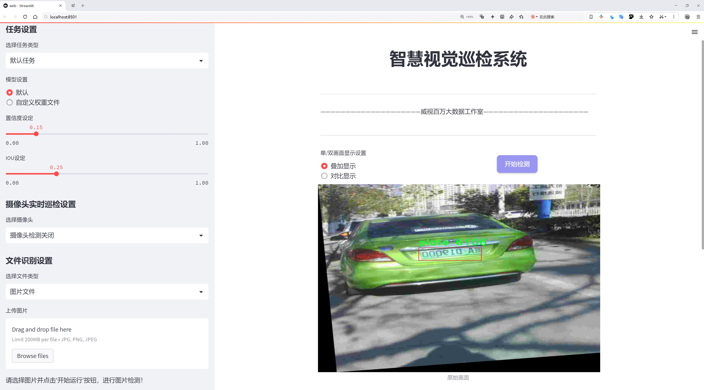
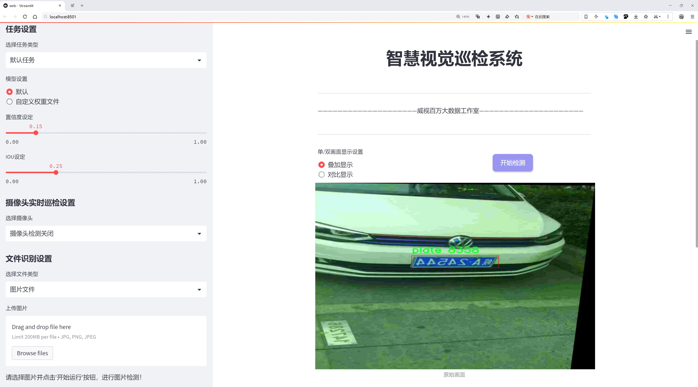
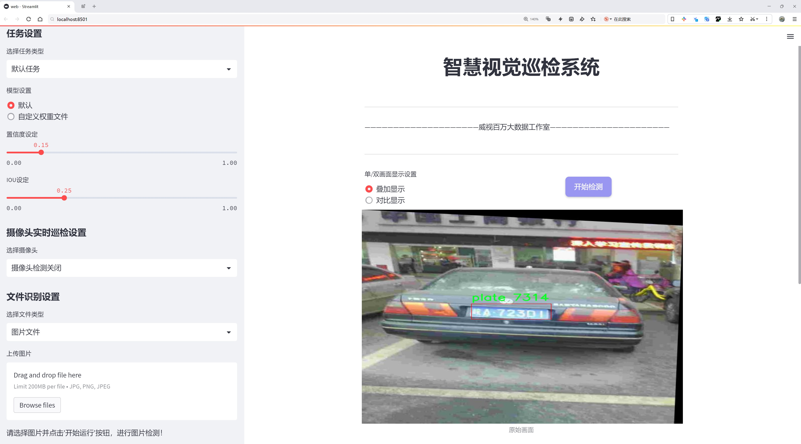
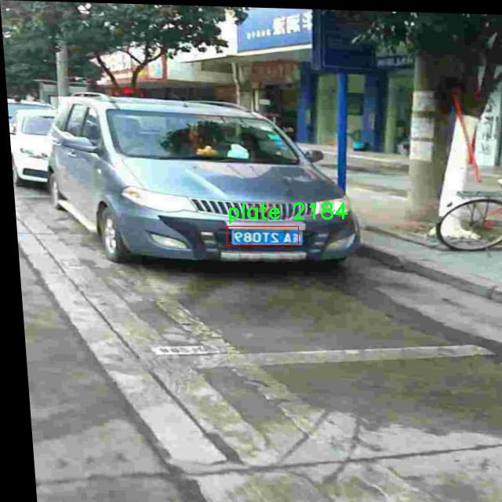
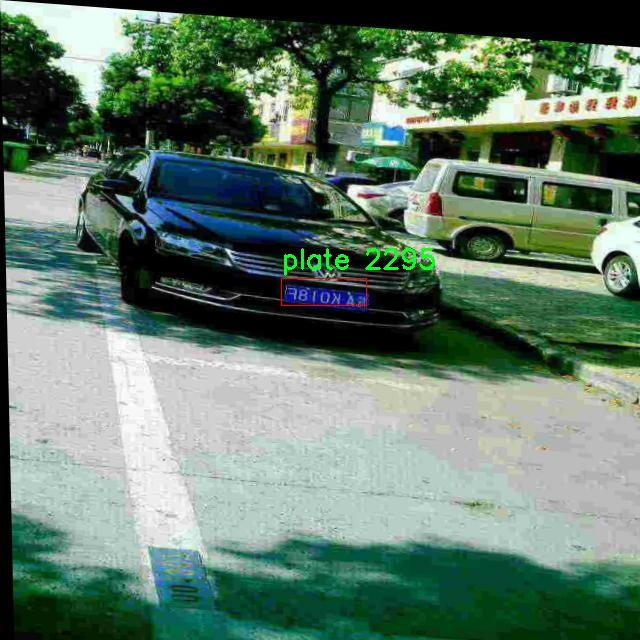
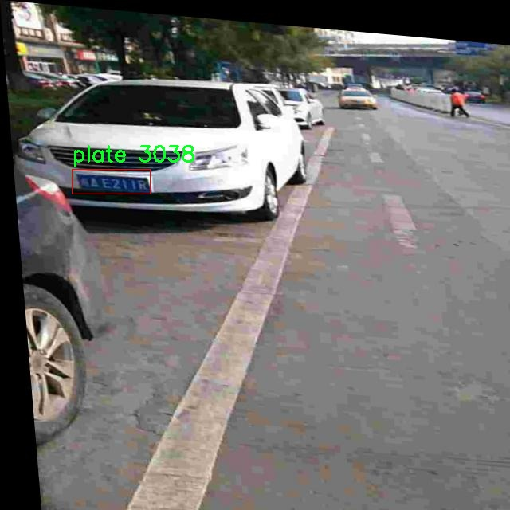
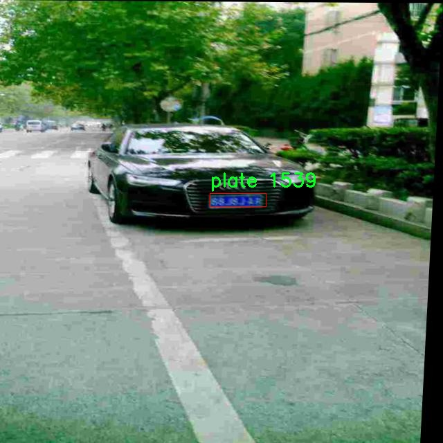
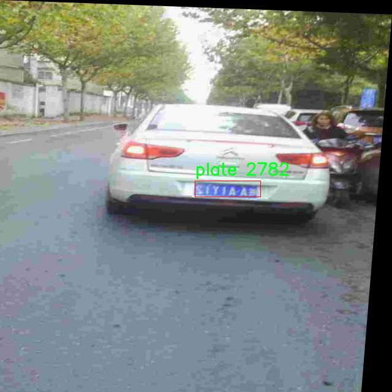

# 中国车牌检测系统源码分享
 # [一条龙教学YOLOV8标注好的数据集一键训练_70+全套改进创新点发刊_Web前端展示]

### 1.研究背景与意义

项目参考[AAAI Association for the Advancement of Artificial Intelligence](https://gitee.com/qunmasj/projects)

项目来源[AACV Association for the Advancement of Computer Vision](https://kdocs.cn/l/cszuIiCKVNis)

研究背景与意义

随着社会经济的快速发展和城市化进程的加快，机动车辆的数量急剧增加，交通管理和安全问题日益突出。在此背景下，车牌识别技术作为智能交通系统的重要组成部分，受到了广泛关注。车牌识别不仅可以有效提高交通管理的效率，还能在车辆监控、违章查处、停车管理等方面发挥重要作用。尤其是在中国，随着智能城市建设的推进，车牌检测技术的需求愈发迫切。

近年来，深度学习技术的迅猛发展为目标检测领域带来了革命性的变化。YOLO（You Only Look Once）系列模型因其高效的实时检测能力和较高的准确率，成为了目标检测任务中的热门选择。YOLOv8作为该系列的最新版本，进一步提升了检测精度和速度，尤其在复杂场景下的表现更为优异。然而，针对中国特有的车牌样式和复杂的交通环境，现有的YOLOv8模型在车牌检测任务中仍存在一定的局限性。因此，基于改进YOLOv8的中国车牌检测系统的研究具有重要的理论价值和实际意义。

本研究所使用的数据集包含5000张图像，专注于单一类别的车牌检测，旨在为YOLOv8模型的改进提供丰富的训练样本。该数据集的构建不仅考虑了车牌的多样性，还涵盖了不同光照、角度和背景条件下的车牌图像，确保了模型在实际应用中的鲁棒性。通过对该数据集的深入分析和处理，我们可以更好地理解中国车牌的特征，进而为模型的优化提供数据支持。

改进YOLOv8的中国车牌检测系统，旨在通过引入针对性的数据增强技术、特征提取方法和后处理策略，提升模型在车牌检测任务中的表现。具体而言，研究将探讨如何通过改进网络结构、调整超参数和优化损失函数等手段，提升模型对车牌的识别精度和实时性。同时，研究还将考虑到车牌检测的实际应用场景，如高速公路监控、城市交通管理等，确保所提出的解决方案能够在真实环境中有效运行。

综上所述，基于改进YOLOv8的中国车牌检测系统的研究，不仅有助于推动车牌识别技术的发展，还能为智能交通系统的建设提供重要的技术支持。通过本研究，我们期望能够为交通管理部门提供更为高效、准确的车牌检测工具，进而提升城市交通管理的智能化水平，促进交通安全和效率的提升。最终，本研究将为中国的智能交通发展贡献一份力量，为构建更加安全、便捷的交通环境奠定基础。

### 2.图片演示







##### 注意：由于此博客编辑较早，上面“2.图片演示”和“3.视频演示”展示的系统图片或者视频可能为老版本，新版本在老版本的基础上升级如下：（实际效果以升级的新版本为准）

  （1）适配了YOLOV8的“目标检测”模型和“实例分割”模型，通过加载相应的权重（.pt）文件即可自适应加载模型。

  （2）支持“图片识别”、“视频识别”、“摄像头实时识别”三种识别模式。

  （3）支持“图片识别”、“视频识别”、“摄像头实时识别”三种识别结果保存导出，解决手动导出（容易卡顿出现爆内存）存在的问题，识别完自动保存结果并导出到tempDir中。

  （4）支持Web前端系统中的标题、背景图等自定义修改，后面提供修改教程。

  另外本项目提供训练的数据集和训练教程,暂不提供权重文件（best.pt）,需要您按照教程进行训练后实现图片演示和Web前端界面演示的效果。

### 3.视频演示

[3.1 视频演示](https://www.bilibili.com/video/BV1TY2NYSETN/)

### 4.数据集信息展示

##### 4.1 本项目数据集详细数据（类别数＆类别名）

nc: 1
names: ['plate']


##### 4.2 本项目数据集信息介绍

数据集信息展示

在本研究中，我们使用的核心数据集为“Chinese license plate detection”，该数据集专门用于训练和改进YOLOv8模型，以实现高效的中国车牌检测。随着智能交通系统的快速发展，车牌识别技术在交通管理、停车场管理以及智能监控等领域的应用愈发广泛。因此，构建一个高质量的车牌检测数据集显得尤为重要。本数据集的设计旨在提供一个多样化且具代表性的样本库，以便于模型在实际应用中能够准确识别和处理各种类型的车牌信息。

该数据集的类别数量为1，具体类别为“plate”，这意味着所有的数据样本均围绕中国车牌进行标注。尽管类别数量相对较少，但数据集中的样本涵盖了不同的车牌样式、颜色、字体以及在不同光照和天气条件下的表现。这种多样性确保了模型在训练过程中能够学习到车牌的各种特征，从而提高其在实际应用中的鲁棒性和准确性。

数据集中的样本经过精心挑选和标注，确保每个车牌的边界框都准确无误。标注过程中，研究团队遵循了严格的标准，以保证数据的高质量和一致性。此外，数据集还包含了多种场景下的车牌图像，例如城市道路、高速公路、停车场等，这些场景的多样性进一步增强了模型的适应能力。通过对不同环境下车牌的捕捉，模型能够在复杂的实际应用中保持良好的识别性能。

为了进一步提升模型的训练效果，数据集还包含了一些挑战性样本，例如部分遮挡、模糊、反光等情况。这些样本的引入旨在模拟真实世界中可能遇到的各种困难，促使模型在处理这些特殊情况时能够展现出更强的适应性和识别能力。通过在训练过程中引入这些复杂样本，模型将能够更好地应对实际应用中的各种挑战，从而提高整体的检测精度。

在数据集的构建过程中，研究团队还考虑到了数据的平衡性和代表性，确保不同类型的车牌样本数量相对均衡，以避免模型在训练过程中出现偏差。通过这种方式，模型能够在识别不同车牌时表现出一致的性能，进而提高其在多种场景下的应用效果。

总之，“Chinese license plate detection”数据集为改进YOLOv8的中国车牌检测系统提供了坚实的基础。通过高质量的样本、多样化的场景以及挑战性样本的引入，数据集不仅提升了模型的训练效果，也为后续的实际应用奠定了良好的基础。随着技术的不断进步和数据集的持续优化，我们有理由相信，未来的车牌检测系统将能够在更广泛的领域中发挥重要作用。











### 5.全套项目环境部署视频教程（零基础手把手教学）

[5.1 环境部署教程链接（零基础手把手教学）](https://www.ixigua.com/7404473917358506534?logTag=c807d0cbc21c0ef59de5)


[5.2 安装Python虚拟环境创建和依赖库安装视频教程链接（零基础手把手教学）](https://www.ixigua.com/7404474678003106304?logTag=1f1041108cd1f708b01a)

### 6.手把手YOLOV8训练视频教程（零基础小白有手就能学会）

[6.1 手把手YOLOV8训练视频教程（零基础小白有手就能学会）](https://www.ixigua.com/7404477157818401292?logTag=d31a2dfd1983c9668658)


按照上面的训练视频教程链接加载项目提供的数据集，运行train.py即可开始训练



     Epoch   gpu_mem       box       obj       cls    labels  img_size
     1/200     20.8G   0.01576   0.01955  0.007536        22      1280: 100%|██████████| 849/849 [14:42<00:00,  1.04s/it]
               Class     Images     Labels          P          R     mAP@.5 mAP@.5:.95: 100%|██████████| 213/213 [01:14<00:00,  2.87it/s]
                 all       3395      17314      0.994      0.957      0.0957      0.0843

     Epoch   gpu_mem       box       obj       cls    labels  img_size
     2/200     20.8G   0.01578   0.01923  0.007006        22      1280: 100%|██████████| 849/849 [14:44<00:00,  1.04s/it]
               Class     Images     Labels          P          R     mAP@.5 mAP@.5:.95: 100%|██████████| 213/213 [01:12<00:00,  2.95it/s]
                 all       3395      17314      0.996      0.956      0.0957      0.0845

     Epoch   gpu_mem       box       obj       cls    labels  img_size
     3/200     20.8G   0.01561    0.0191  0.006895        27      1280: 100%|██████████| 849/849 [10:56<00:00,  1.29it/s]
               Class     Images     Labels          P          R     mAP@.5 mAP@.5:.95: 100%|███████   | 187/213 [00:52<00:00,  4.04it/s]
                 all       3395      17314      0.996      0.957      0.0957      0.0845


### 7.70+种全套YOLOV8创新点代码加载调参视频教程（一键加载写好的改进模型的配置文件）

[7.1 70+种全套YOLOV8创新点代码加载调参视频教程（一键加载写好的改进模型的配置文件）](https://www.ixigua.com/7404478314661806627?logTag=29066f8288e3f4eea3a4)

### 8.70+种全套YOLOV8创新点原理讲解（非科班也可以轻松写刊发刊，V10版本正在科研待更新）

#### 由于篇幅限制，每个创新点的具体原理讲解就不一一展开，具体见下列网址中的创新点对应子项目的技术原理博客网址【Blog】：


[8.1 70+种全套YOLOV8创新点原理讲解链接](https://gitee.com/qunmasj/good)

#### 部分改进原理讲解(完整的改进原理见上图和技术博客链接)【如果此小节的图加载失败可以通过CSDN或者Github搜索该博客的标题访问原始博客，原始博客图片显示正常】
### YOLOv8算法原理
YOLOv8算法由Glenn-Jocher 提出，是跟YOLOv3算法、YOLOv5算法一脉相承的，主要的改进点如下:
(1)数据预处理。YOLOv8的数据预处理依旧采用YOLOv5的策略,在训练时，主要采用包括马赛克增强(Mosaic)、混合增强(Mixup)、空间扰动(randomperspective)以及颜色扰动(HSV augment)四个增强手段。
(2)骨干网络结构。YOLOv8的骨干网络结构可从YOLOv5略见一斑，YOLOv5的主干网络的架构规律十分清晰，总体来看就是每用一层步长为2的3×3卷积去降采样特征图，接一个C3模块来进一步强化其中的特征，且C3的基本深度参数分别为“3/6/9/3”，其会根据不同规模的模型的来做相应的缩放。在的YOLOv8中，大体上也还是继承了这一特点，原先的C3模块均被替换成了新的C2f模块，C2f 模块加入更多的分支，丰富梯度回传时的支流。下面展示了YOLOv8的C2f模块和YOLOv5的C3模块，其网络结构图所示。


(3)FPN-PAN结构。YOLOv8仍采用FPN+PAN结构来构建YOLO的特征金字塔，使多尺度信息之间进行充分的融合。除了FPN-PAN里面的C3模块被替换为C2f模块外，其余部分与YOLOv5的FPN-PAN结构基本一致。
(4)Detection head结构。从 YOLOv3到 YOLOv5，其检测头一直都是“耦合”(Coupled)的,即使用一层卷积同时完成分类和定位两个任务，直到YOLOX的问世， YOLO系列才第一次换装“解耦头”(Decoupled Head)。YOLOv8也同样也采用了解耦头的结构，两条并行的分支分别取提取类别特征和位置特征，然后各用一层1x1卷积完成分类和定位任务。YOLOv8整体的网络结构由图所示。


(5)标签分配策略。尽管YOLOv5设计了自动聚类候选框的一些功能，但是聚类候选框是依赖于数据集的。若数据集不够充分，无法较为准确地反映数据本身的分布特征，聚类出来的候选框也会与真实物体尺寸比例悬殊过大。YOLOv8没有采用候选框策略，所以解决的问题就是正负样本匹配的多尺度分配。不同于YOLOX所使用的 SimOTA，YOLOv8在标签分配问题上采用了和YOLOv6相同的TOOD策略，是一种动态标签分配策略。YOLOv8只用到了targetboze。和target scores，未含是否有物体预测，故 YOLOv8的损失就主要包括两大部分∶类别损失和位置损失。对于YOLOv8，其分类损失为VFLLoss(Varifocal Loss)，其回归损失为CIoU Loss 与 DFL Loss 的形式。
其中 Varifocal Loss定义如下:


其中p为预测的类别得分，p ∈ [0.1]。q为预测的目标分数(若为真实类别，则q为预测和真值的 loU;若为其他类别。q为0 )。VFL Loss使用不对称参数来对正负样本进行加权，通过只对负样本进行衰减，达到不对等的处理前景和背景对损失的贡献。对正样本，使用q进行了加权，如果正样本的GTiou很高时,则对损失的贡献更大一些，可以让网络聚焦于那些高质量的样本上，即训练高质量的正例对AP的提升比低质量的更大一些。对负样本，使用p进行了降权，降低了负例对损失的贡献，因负样本的预测p在取次幂后会变得更小，这样就能够降低负样本对损失的整体贡献。

### 动态蛇形卷积Dynamic Snake Convolution

参考论文： 2307.08388.pdf (arxiv.org)

血管、道路等拓扑管状结构的精确分割在各个领域都至关重要，确保下游任务的准确性和效率。 然而，许多因素使任务变得复杂，包括薄的局部结构和可变的全局形态。在这项工作中，我们注意到管状结构的特殊性，并利用这些知识来指导我们的 DSCNet 在三个阶段同时增强感知：特征提取、特征融合、 和损失约束。 首先，我们提出了一种动态蛇卷积，通过自适应地关注细长和曲折的局部结构来准确捕获管状结构的特征。 随后，我们提出了一种多视图特征融合策略，以补充特征融合过程中多角度对特征的关注，确保保留来自不同全局形态的重要信息。 最后，提出了一种基于持久同源性的连续性约束损失函数，以更好地约束分割的拓扑连续性。 2D 和 3D 数据集上的实验表明，与多种方法相比，我们的 DSCNet 在管状结构分割任务上提供了更好的准确性和连续性。 我们的代码是公开的。 
主要的挑战源于细长微弱的局部结构特征与复杂多变的全局形态特征。本文关注到管状结构细长连续的特点，并利用这一信息在神经网络以下三个阶段同时增强感知：特征提取、特征融合和损失约束。分别设计了动态蛇形卷积（Dynamic Snake Convolution），多视角特征融合策略与连续性拓扑约束损失。 

我们希望卷积核一方面能够自由地贴合结构学习特征，另一方面能够在约束条件下不偏离目标结构太远。在观察管状结构的细长连续的特征后，脑海里想到了一个动物——蛇。我们希望卷积核能够像蛇一样动态地扭动，来贴合目标的结构。

我们希望卷积核一方面能够自由地贴合结构学习特征，另一方面能够在约束条件下不偏离目标结构太远。在观察管状结构的细长连续的特征后，脑海里想到了一个动物——蛇。我们希望卷积核能够像蛇一样动态地扭动，来贴合目标的结构。


### DCNV2融入YOLOv8
DCN和DCNv2（可变性卷积）
网上关于两篇文章的详细描述已经很多了，我这里具体的细节就不多讲了，只说一下其中实现起来比较困惑的点。（黑体字会讲解）

DCNv1解决的问题就是我们常规的图像增强，仿射变换（线性变换加平移）不能解决的多种形式目标变换的几何变换的问题。如下图所示。

可变性卷积的思想很简单，就是讲原来固定形状的卷积核变成可变的。如下图所示：


首先来看普通卷积，以3x3卷积为例对于每个输出y(p0)，都要从x上采样9个位置，这9个位置都在中心位置x(p0)向四周扩散得到的gird形状上，(-1,-1)代表x(p0)的左上角，(1,1)代表x(p0)的右下角，其他类似。

用公式表示如下：


可变性卷积Deformable Conv操作并没有改变卷积的计算操作，而是在卷积操作的作用区域上，加入了一个可学习的参数∆pn。同样对于每个输出y(p0)，都要从x上采样9个位置，这9个位置是中心位置x(p0)向四周扩散得到的，但是多了 ∆pn，允许采样点扩散成非gird形状。


偏移量是通过对原始特征层进行卷积得到的。比如输入特征层是w×h×c，先对输入的特征层进行卷积操作，得到w×h×2c的offset field。这里的w和h和原始特征层的w和h是一致的，offset field里面的值是输入特征层对应位置的偏移量，偏移量有x和y两个方向，所以offset field的channel数是2c。offset field里的偏移量是卷积得到的，可能是浮点数，所以接下来需要通过双向性插值计算偏移位置的特征值。在偏移量的学习中，梯度是通过双线性插值来进行反向传播的。
看到这里是不是还是有点迷茫呢？那到底程序上面怎么实现呢？


事实上由上面的公式我们可以看得出来∆pn这个偏移量是加在原像素点上的，但是我们怎么样从代码上对原像素点加这个量呢？其实很简单，就是用一个普通的卷积核去跟输入图片（一般是输入的feature_map）卷积就可以了卷积核的数量是2N也就是23*3==18（前9个通道是x方向的偏移量，后9个是y方向的偏移量），然后把这个卷积的结果与正常卷积的结果进行相加就可以了。
然后又有了第二个问题，怎么样反向传播呢？为什么会有这个问题呢？因为求出来的偏移量+正常卷积输出的结果往往是一个浮点数，浮点数是无法对应到原图的像素点的，所以自然就想到了双线性差值的方法求出浮点数对应的浮点像素点。


#### DCN v2
对于positive的样本来说，采样的特征应该focus在RoI内，如果特征中包含了过多超出RoI的内容，那么结果会受到影响和干扰。而negative样本则恰恰相反，引入一些超出RoI的特征有助于帮助网络判别这个区域是背景区域。

DCNv1引入了可变形卷积，能更好的适应目标的几何变换。但是v1可视化结果显示其感受野对应位置超出了目标范围，导致特征不受图像内容影响（理想情况是所有的对应位置分布在目标范围以内）。

为了解决该问题：提出v2, 主要有

1、扩展可变形卷积，增强建模能力
2、提出了特征模拟方案指导网络培训：feature mimicking scheme

上面这段话是什么意思呢，通俗来讲就是，我们的可变性卷积的区域大于目标所在区域，所以这时候就会对非目标区域进行错误识别。

所以自然能想到的解决方案就是加入权重项进行惩罚。（至于这个实现起来就比较简单了，直接初始化一个权重然后乘(input+offsets)就可以了）


可调节的RoIpooling也是类似的，公式如下：


### 9.系统功能展示（检测对象为举例，实际内容以本项目数据集为准）

图9.1.系统支持检测结果表格显示

  图9.2.系统支持置信度和IOU阈值手动调节

  图9.3.系统支持自定义加载权重文件best.pt(需要你通过步骤5中训练获得)

  图9.4.系统支持摄像头实时识别

  图9.5.系统支持图片识别

  图9.6.系统支持视频识别

  图9.7.系统支持识别结果文件自动保存

  图9.8.系统支持Excel导出检测结果数据


### 10.原始YOLOV8算法原理

原始YOLOv8算法原理

YOLOv8作为YOLO系列的最新版本，代表了目标检测领域的一次重要技术革新。它不仅在性能上超越了前代模型，还在架构设计和算法实现上进行了多项创新，旨在提高目标检测的速度和准确性。YOLOv8的设计理念依然遵循“一阶段”目标检测的框架，将目标检测任务转化为一个回归问题，利用单一的神经网络模型同时预测目标的位置和类别。其核心结构由主干网络（Backbone）、特征增强网络（Neck）和检测头（Head）三部分组成，形成了一个高效的特征提取和目标检测体系。

在主干网络部分，YOLOv8采用了CSPDarknet（Cross Stage Partial Darknet）结构，这一设计通过将网络分为两个部分并引入多个残差块，显著提升了特征提取的能力。与YOLOv5相比，YOLOv8使用了C2f模块替代了C3模块，C2f模块的设计使得输入特征图被分为两个分支，经过卷积层进行降维处理。每个分支的输出都被作为新的特征图分支进行堆叠，这种结构的设计不仅增加了特征图的维度，还通过融合操作增强了梯度流的信息，从而提升了模型的学习能力。

特征增强网络部分则采用了特征金字塔网络（FPN）与路径聚合网络（PAN）的结合，形成了一个高效的特征处理模块。通过多层卷积和池化操作，特征图得以压缩和处理，使得模型能够在不同尺度上提取到丰富的特征信息。此外，YOLOv8引入了快速空间金字塔池化（SPPF）结构，进一步提高了特征提取的效率，降低了模型的参数量和计算量。这一创新使得YOLOv8在处理高分辨率图像时，能够保持较高的检测精度。

在检测头部分，YOLOv8的设计同样具有创新性。它采用了解耦头的结构，将目标分类和回归任务分开处理，避免了以往耦合头在复杂场景下可能导致的定位不准和分类错误的问题。通过这种解耦设计，YOLOv8能够更专注于各自的任务，提高了模型在多样化场景下的适应能力。此外，YOLOv8引入了无锚框（Anchor-Free）的检测方式，直接预测目标的中心点及其宽高比例。这一方法有效地减少了对锚框的依赖，使得模型在不同尺度和形状的目标检测中表现更加出色。

YOLOv8的损失函数也进行了优化，以适应新的网络结构和目标检测方式。新的损失函数设计旨在提高模型在训练过程中的收敛速度和准确性，使得YOLOv8在各种硬件平台上都能高效运行。通过这些改进，YOLOv8不仅在训练时间和检测精度上取得了显著提升，其权重文件也得到了轻量化，能够适应嵌入式设备的部署需求。

总的来说，YOLOv8在继承YOLO系列优良传统的基础上，通过一系列创新设计，提升了目标检测的性能。它的高效特征提取能力、灵活的网络结构以及先进的无锚框检测方式，使得YOLOv8在实时目标检测任务中表现卓越，能够满足现代计算机视觉应用对速度和准确性的双重需求。无论是在复杂的环境中进行目标识别，还是在高分辨率图像中提取细节，YOLOv8都展现出了强大的能力，成为了目标检测领域的一颗璀璨明珠。


### 11.项目核心源码讲解（再也不用担心看不懂代码逻辑）

#### 11.1 ui.py

以下是经过简化和注释的核心代码部分：

```python
import sys
import subprocess
from QtFusion.path import abs_path

def run_script(script_path):
    """
    使用当前 Python 环境运行指定的脚本。

    Args:
        script_path (str): 要运行的脚本路径
    """
    # 获取当前 Python 解释器的路径
    python_path = sys.executable

    # 构建运行命令，使用 streamlit 运行指定的脚本
    command = f'"{python_path}" -m streamlit run "{script_path}"'

    # 执行命令并等待其完成
    result = subprocess.run(command, shell=True)
    
    # 检查命令执行结果，如果返回码不为0，表示出错
    if result.returncode != 0:
        print("脚本运行出错。")

# 主程序入口
if __name__ == "__main__":
    # 获取要运行的脚本的绝对路径
    script_path = abs_path("web.py")

    # 调用函数运行指定的脚本
    run_script(script_path)
```

### 代码说明：
1. **导入模块**：
   - `sys`：用于获取当前 Python 解释器的路径。
   - `subprocess`：用于执行外部命令。
   - `abs_path`：从 `QtFusion.path` 导入的函数，用于获取文件的绝对路径。

2. **`run_script` 函数**：
   - 接受一个参数 `script_path`，表示要运行的 Python 脚本的路径。
   - 使用 `sys.executable` 获取当前 Python 解释器的路径。
   - 构建一个命令字符串，使用 `streamlit` 运行指定的脚本。
   - 使用 `subprocess.run` 执行命令，并等待其完成。
   - 检查命令的返回码，如果不为0，表示脚本运行出错，打印错误信息。

3. **主程序入口**：
   - 当脚本作为主程序运行时，获取 `web.py` 的绝对路径。
   - 调用 `run_script` 函数来执行该脚本。

这个程序文件名为 `ui.py`，其主要功能是运行一个指定的 Python 脚本，具体来说是使用 Streamlit 框架来启动一个 Web 应用。

首先，文件中导入了一些必要的模块，包括 `sys`、`os` 和 `subprocess`。`sys` 模块用于访问与 Python 解释器相关的变量和函数，`os` 模块提供了与操作系统交互的功能，而 `subprocess` 模块则用于执行外部命令。

接下来，文件中定义了一个名为 `run_script` 的函数，该函数接受一个参数 `script_path`，表示要运行的脚本的路径。在函数内部，首先获取当前 Python 解释器的路径，这通过 `sys.executable` 实现。然后，构建一个命令字符串，使用 Streamlit 运行指定的脚本。命令的格式是 `"{python_path}" -m streamlit run "{script_path}"`，其中 `{python_path}` 和 `{script_path}` 分别被替换为当前 Python 解释器的路径和要运行的脚本的路径。

接着，使用 `subprocess.run` 方法执行构建好的命令。这个方法会在一个新的进程中运行命令，并等待其完成。如果命令执行的返回码不为 0，表示脚本运行出错，程序会打印出相应的错误信息。

在文件的最后部分，使用 `if __name__ == "__main__":` 语句来确保只有在直接运行该脚本时才会执行后面的代码。在这里，首先调用 `abs_path` 函数获取名为 `web.py` 的脚本的绝对路径，然后调用 `run_script` 函数来运行这个脚本。

总体来说，这个文件的主要目的是为了方便地启动一个 Streamlit Web 应用，通过指定脚本路径并利用当前 Python 环境来执行该脚本。

#### 11.2 70+种YOLOv8算法改进源码大全和调试加载训练教程（非必要）\ultralytics\models\sam\modules\transformer.py

以下是代码中最核心的部分，并附上详细的中文注释：

```python
import math
import torch
from torch import Tensor, nn

class Attention(nn.Module):
    """一个注意力层，允许在对查询、键和值进行投影后缩小嵌入的大小。"""

    def __init__(self, embedding_dim: int, num_heads: int, downsample_rate: int = 1) -> None:
        """
        初始化注意力模型，设置嵌入维度和头数。

        Args:
            embedding_dim (int): 输入嵌入的维度。
            num_heads (int): 注意力头的数量。
            downsample_rate (int, optional): 内部维度缩小的因子，默认为1。
        """
        super().__init__()
        self.embedding_dim = embedding_dim
        self.internal_dim = embedding_dim // downsample_rate  # 计算内部维度
        self.num_heads = num_heads
        assert self.internal_dim % num_heads == 0, 'num_heads必须能整除embedding_dim。'

        # 定义线性层用于查询、键和值的投影
        self.q_proj = nn.Linear(embedding_dim, self.internal_dim)
        self.k_proj = nn.Linear(embedding_dim, self.internal_dim)
        self.v_proj = nn.Linear(embedding_dim, self.internal_dim)
        self.out_proj = nn.Linear(self.internal_dim, embedding_dim)  # 输出投影

    @staticmethod
    def _separate_heads(x: Tensor, num_heads: int) -> Tensor:
        """将输入张量分离为指定数量的注意力头。"""
        b, n, c = x.shape  # b: 批量大小, n: 序列长度, c: 通道数
        x = x.reshape(b, n, num_heads, c // num_heads)  # 重塑为 B x N x N_heads x C_per_head
        return x.transpose(1, 2)  # 转置为 B x N_heads x N_tokens x C_per_head

    @staticmethod
    def _recombine_heads(x: Tensor) -> Tensor:
        """将分离的注意力头重新组合为单个张量。"""
        b, n_heads, n_tokens, c_per_head = x.shape
        x = x.transpose(1, 2)  # 转置为 B x N_tokens x N_heads x C_per_head
        return x.reshape(b, n_tokens, n_heads * c_per_head)  # 重塑为 B x N_tokens x C

    def forward(self, q: Tensor, k: Tensor, v: Tensor) -> Tensor:
        """计算给定输入查询、键和值张量的注意力输出。"""

        # 输入投影
        q = self.q_proj(q)  # 投影查询
        k = self.k_proj(k)  # 投影键
        v = self.v_proj(v)  # 投影值

        # 分离为多个头
        q = self._separate_heads(q, self.num_heads)
        k = self._separate_heads(k, self.num_heads)
        v = self._separate_heads(v, self.num_heads)

        # 计算注意力
        _, _, _, c_per_head = q.shape
        attn = q @ k.permute(0, 1, 3, 2)  # 计算注意力得分
        attn = attn / math.sqrt(c_per_head)  # 缩放
        attn = torch.softmax(attn, dim=-1)  # 应用softmax以获得注意力权重

        # 获取输出
        out = attn @ v  # 使用注意力权重加权值
        out = self._recombine_heads(out)  # 重新组合头
        return self.out_proj(out)  # 最终输出投影
```

### 代码核心部分说明：
1. **Attention类**：实现了基本的注意力机制，能够将输入的查询、键和值进行投影，并计算注意力输出。
2. **初始化方法**：设置嵌入维度、头数和内部维度，并定义线性层用于查询、键和值的投影。
3. **_separate_heads和_recombine_heads方法**：分别用于将输入张量分离为多个注意力头和将这些头重新组合为单个张量。
4. **forward方法**：实现了注意力计算的核心逻辑，包括输入投影、注意力得分计算、应用softmax和最终输出的组合。

这些部分构成了Transformer中注意力机制的基础，能够有效地处理输入数据并提取特征。

这个程序文件定义了一个名为 `TwoWayTransformer` 的类，它是一个双向变换器模块，能够同时关注图像和查询点。这个类作为一个专门的变换器解码器，利用提供的查询的位置信息嵌入来关注输入图像，特别适用于目标检测、图像分割和点云处理等任务。

在 `TwoWayTransformer` 类的构造函数中，定义了一些关键属性，包括变换器的层数（`depth`）、输入嵌入的通道维度（`embedding_dim`）、多头注意力的头数（`num_heads`）、MLP块的内部通道维度（`mlp_dim`）等。接着，利用 `nn.ModuleList` 创建了多个 `TwoWayAttentionBlock` 层，这些层构成了变换器的主体。最后，定义了一个最终的注意力层和一个层归一化层，用于处理查询和图像之间的最终交互。

在 `forward` 方法中，首先将输入的图像嵌入和位置编码进行展平和转置，以便于后续处理。然后，准备查询和键的输入，分别为点嵌入和图像嵌入。接下来，依次通过每个变换器层进行处理，更新查询和键的嵌入。最后，应用最终的注意力层，将处理后的查询和键返回。

此外，文件中还定义了 `TwoWayAttentionBlock` 类，这是一个包含自注意力和交叉注意力的注意力块。它由四个主要层组成：稀疏输入的自注意力、稀疏输入到密集输入的交叉注意力、稀疏输入的MLP块，以及密集输入到稀疏输入的交叉注意力。在构造函数中，初始化了这些层，并在 `forward` 方法中实现了自注意力和交叉注意力的处理。

最后，文件中还定义了一个 `Attention` 类，提供了一个允许在投影到查询、键和值后对嵌入进行下采样的注意力层。该类的构造函数初始化了输入嵌入的维度、注意力头的数量以及下采样率。它还包含了一些静态方法，用于将输入张量分离成多个注意力头以及重新组合这些头的输出。

总体来说，这个程序文件实现了一个复杂的双向变换器结构，结合了自注意力和交叉注意力机制，能够有效地处理图像和查询点之间的关系，为各种计算机视觉任务提供支持。

#### 11.3 70+种YOLOv8算法改进源码大全和调试加载训练教程（非必要）\ultralytics\trackers\bot_sort.py

以下是经过简化并添加详细中文注释的核心代码部分：

```python
# 引入必要的库
from collections import deque
import numpy as np
from .basetrack import TrackState
from .byte_tracker import BYTETracker, STrack
from .utils import matching
from .utils.gmc import GMC
from .utils.kalman_filter import KalmanFilterXYWH

class BOTrack(STrack):
    """
    BOTrack类是STrack类的扩展版本，添加了目标跟踪功能。
    """

    # 共享的卡尔曼滤波器实例
    shared_kalman = KalmanFilterXYWH()

    def __init__(self, tlwh, score, cls, feat=None, feat_history=50):
        """
        初始化BOTrack实例，设置目标的初始状态和特征。
        
        参数:
            tlwh: 目标的边界框信息 (左上角x, 左上角y, 宽度, 高度)
            score: 目标的置信度分数
            cls: 目标的类别
            feat: 目标的特征向量
            feat_history: 特征历史记录的最大长度
        """
        super().__init__(tlwh, score, cls)  # 调用父类构造函数
        self.smooth_feat = None  # 平滑特征
        self.curr_feat = None  # 当前特征
        if feat is not None:
            self.update_features(feat)  # 更新特征
        self.features = deque([], maxlen=feat_history)  # 存储特征的双端队列
        self.alpha = 0.9  # 平滑因子

    def update_features(self, feat):
        """
        更新特征向量，并使用指数移动平均进行平滑。
        
        参数:
            feat: 新的特征向量
        """
        feat /= np.linalg.norm(feat)  # 归一化特征向量
        self.curr_feat = feat  # 更新当前特征
        if self.smooth_feat is None:
            self.smooth_feat = feat  # 如果没有平滑特征，则直接赋值
        else:
            # 使用指数移动平均更新平滑特征
            self.smooth_feat = self.alpha * self.smooth_feat + (1 - self.alpha) * feat
        self.features.append(feat)  # 将新特征添加到队列
        self.smooth_feat /= np.linalg.norm(self.smooth_feat)  # 归一化平滑特征

    def predict(self):
        """
        使用卡尔曼滤波器预测目标的状态。
        """
        mean_state = self.mean.copy()  # 复制当前状态
        if self.state != TrackState.Tracked:
            mean_state[6] = 0  # 如果状态不是跟踪状态，重置速度
            mean_state[7] = 0

        # 使用卡尔曼滤波器进行预测
        self.mean, self.covariance = self.kalman_filter.predict(mean_state, self.covariance)

    @property
    def tlwh(self):
        """
        获取当前目标的位置，以边界框格式返回 (左上角x, 左上角y, 宽度, 高度)。
        """
        if self.mean is None:
            return self._tlwh.copy()  # 如果没有均值，返回初始值
        ret = self.mean[:4].copy()  # 复制前四个值
        ret[:2] -= ret[2:] / 2  # 计算左上角坐标
        return ret

class BOTSORT(BYTETracker):
    """
    BOTSORT类是BYTETracker类的扩展版本，设计用于YOLOv8的目标跟踪。
    """

    def __init__(self, args, frame_rate=30):
        """
        初始化BOTSORT实例，设置跟踪参数。
        
        参数:
            args: 命令行参数，包含跟踪参数
            frame_rate: 帧率
        """
        super().__init__(args, frame_rate)  # 调用父类构造函数
        self.proximity_thresh = args.proximity_thresh  # 空间接近阈值
        self.appearance_thresh = args.appearance_thresh  # 外观相似性阈值
        self.gmc = GMC(method=args.gmc_method)  # 初始化GMC算法实例

    def init_track(self, dets, scores, cls, img=None):
        """
        使用检测结果初始化跟踪。
        
        参数:
            dets: 检测到的边界框
            scores: 检测的置信度分数
            cls: 检测的类别
            img: 输入图像（可选）
        """
        if len(dets) == 0:
            return []  # 如果没有检测结果，返回空列表
        return [BOTrack(xyxy, s, c) for (xyxy, s, c) in zip(dets, scores, cls)]  # 返回BOTrack实例列表

    def get_dists(self, tracks, detections):
        """
        计算跟踪与检测之间的距离。
        
        参数:
            tracks: 当前跟踪的目标
            detections: 当前检测到的目标
        """
        dists = matching.iou_distance(tracks, detections)  # 计算IoU距离
        # 这里可以添加其他距离计算逻辑
        return dists  # 返回距离矩阵

    def multi_predict(self, tracks):
        """
        预测多个目标的状态。
        
        参数:
            tracks: 当前跟踪的目标列表
        """
        BOTrack.multi_predict(tracks)  # 调用BOTrack的多目标预测方法
```

### 代码说明：
1. **BOTrack类**：负责目标的跟踪，使用卡尔曼滤波器来预测目标状态，并维护特征向量的平滑处理。
2. **BOTSORT类**：扩展了BYTETracker，负责初始化跟踪并计算目标之间的距离。
3. **特征更新**：通过指数移动平均来平滑特征，避免特征的剧烈波动。
4. **预测功能**：使用卡尔曼滤波器进行状态预测，确保目标在视频帧中的连续性。

这个程序文件是关于YOLOv8算法中的对象跟踪功能的实现，主要包含两个类：`BOTrack`和`BOTSORT`。`BOTrack`类是对YOLOv8中STrack类的扩展，增加了对象跟踪的特性。它使用了卡尔曼滤波器来预测对象的位置，并通过特征向量来平滑跟踪。类中定义了一些属性，例如共享的卡尔曼滤波器、平滑特征向量、当前特征向量、特征历史记录等。`update_features`方法用于更新特征向量并进行平滑处理，`predict`方法则利用卡尔曼滤波器进行状态预测。`re_activate`和`update`方法用于重新激活和更新跟踪状态。

`BOTSORT`类是对BYTETracker类的扩展，专为YOLOv8设计，支持对象跟踪、ReID（重识别）和GMC（全局运动补偿）算法。该类包含一些属性，例如空间接近阈值、外观相似性阈值、ReID嵌入处理对象和GMC实例。`init_track`方法用于初始化跟踪，`get_dists`方法计算跟踪与检测之间的距离，支持IoU和ReID嵌入的结合。`multi_predict`方法则用于预测和跟踪多个对象。

整体来看，这个文件的实现旨在增强YOLOv8在视频监控和对象跟踪任务中的性能，结合了卡尔曼滤波、特征平滑和重识别技术，使得跟踪更加准确和稳定。

#### 11.4 code\ultralytics\solutions\ai_gym.py

以下是经过简化和注释的核心代码部分：

```python
import cv2
from ultralytics.utils.checks import check_imshow
from ultralytics.utils.plotting import Annotator

class AIGym:
    """用于管理实时视频流中人们的健身动作计数的类。"""

    def __init__(self):
        """初始化AIGym，设置视觉和图像参数的默认值。"""
        self.im0 = None  # 当前帧图像
        self.tf = None   # 线条厚度
        self.keypoints = None  # 关键点数据
        self.poseup_angle = None  # 上升角度阈值
        self.posedown_angle = None  # 下降角度阈值
        self.threshold = 0.001  # 阈值
        self.angle = None  # 角度数据
        self.count = None  # 动作计数
        self.stage = None  # 当前阶段
        self.pose_type = "pushup"  # 动作类型（如俯卧撑）
        self.kpts_to_check = None  # 需要检查的关键点
        self.view_img = False  # 是否显示图像
        self.annotator = None  # 注释工具
        self.env_check = check_imshow(warn=True)  # 检查环境是否支持imshow

    def set_args(self, kpts_to_check, line_thickness=2, view_img=False, pose_up_angle=145.0, pose_down_angle=90.0, pose_type="pullup"):
        """
        配置AIGym的参数
        Args:
            kpts_to_check (list): 用于计数的3个关键点
            line_thickness (int): 边框线条的厚度
            view_img (bool): 是否显示图像
            pose_up_angle (float): 上升姿势的角度
            pose_down_angle (float): 下降姿势的角度
            pose_type: 动作类型（如俯卧撑、引体向上或腹部锻炼）
        """
        self.kpts_to_check = kpts_to_check
        self.tf = line_thickness
        self.view_img = view_img
        self.poseup_angle = pose_up_angle
        self.posedown_angle = pose_down_angle
        self.pose_type = pose_type

    def start_counting(self, im0, results, frame_count):
        """
        计数健身动作的函数
        Args:
            im0 (ndarray): 当前视频帧
            results: 姿态估计数据
            frame_count: 当前帧计数
        """
        self.im0 = im0  # 保存当前帧
        if frame_count == 1:
            # 初始化计数、角度和阶段
            self.count = [0] * len(results[0])
            self.angle = [0] * len(results[0])
            self.stage = ["-" for _ in results[0]]
        
        self.keypoints = results[0].keypoints.data  # 获取关键点数据
        self.annotator = Annotator(im0, line_width=2)  # 初始化注释工具

        num_keypoints = len(results[0])  # 关键点数量

        # 如果关键点数量变化，调整相应的列表
        if len(self.angle) != num_keypoints:
            self.angle = [0] * num_keypoints
            self.count = [0] * num_keypoints
            self.stage = ["-" for _ in range(num_keypoints)]

        # 遍历每个关键点，进行姿态角度估计和计数
        for ind, k in enumerate(reversed(self.keypoints)):
            self.angle[ind] = self.annotator.estimate_pose_angle(
                k[int(self.kpts_to_check[0])].cpu(),
                k[int(self.kpts_to_check[1])].cpu(),
                k[int(self.kpts_to_check[2])].cpu(),
            )
            self.im0 = self.annotator.draw_specific_points(k, self.kpts_to_check, shape=(640, 640), radius=10)

            # 根据动作类型更新阶段和计数
            if self.pose_type == "pushup":
                if self.angle[ind] > self.poseup_angle:
                    self.stage[ind] = "up"
                if self.angle[ind] < self.posedown_angle and self.stage[ind] == "up":
                    self.stage[ind] = "down"
                    self.count[ind] += 1
            
            # 绘制角度、计数和阶段信息
            self.annotator.plot_angle_and_count_and_stage(
                angle_text=self.angle[ind],
                count_text=self.count[ind],
                stage_text=self.stage[ind],
                center_kpt=k[int(self.kpts_to_check[1])],
                line_thickness=self.tf,
            )

            self.annotator.kpts(k, shape=(640, 640), radius=1, kpt_line=True)  # 绘制关键点

        # 如果支持imshow并且需要显示图像，则显示当前帧
        if self.env_check and self.view_img:
            cv2.imshow("Ultralytics YOLOv8 AI GYM", self.im0)
            if cv2.waitKey(1) & 0xFF == ord("q"):
                return

        return self.im0  # 返回处理后的图像

if __name__ == "__main__":
    AIGym()  # 创建AIGym实例
```

### 代码注释说明：
1. **类和方法定义**：定义了一个`AIGym`类，包含初始化方法和设置参数的方法，以及开始计数的方法。
2. **初始化方法**：设置了多个属性以存储图像、关键点、计数、角度和阶段等信息。
3. **设置参数方法**：允许用户配置关键点、线条厚度、是否显示图像等参数。
4. **开始计数方法**：处理每一帧图像，估计姿态角度，并根据设定的阈值更新计数和阶段，同时绘制相关信息。
5. **图像显示**：在支持的环境中显示处理后的图像，并提供退出机制。

这个程序文件定义了一个名为 `AIGym` 的类，主要用于在实时视频流中基于人体姿态管理健身动作的计数。程序首先导入了必要的库，包括 OpenCV 和 Ultralytics 的一些工具函数。

在 `AIGym` 类的构造函数 `__init__` 中，初始化了一些用于图像处理和姿态估计的参数，包括图像数据、关键点、角度、计数、阶段等信息。这里还定义了一个 `pose_type` 属性，用于指定当前的健身动作类型（如俯卧撑、引体向上或腹部锻炼），并使用 `check_imshow` 函数检查当前环境是否支持图像显示。

`set_args` 方法用于配置 `AIGym` 的一些参数，包括需要检查的关键点、线条厚度、是否显示图像、上举和下放的角度阈值以及动作类型。这些参数可以根据用户的需求进行调整。

`start_counting` 方法是主要的计数逻辑。它接收当前帧图像、姿态估计结果和帧计数作为输入。方法内部首先处理图像数据和初始化计数、角度和阶段信息。然后，它会根据指定的动作类型（如俯卧撑、引体向上或腹部锻炼）计算每个关键点的角度，并根据角度的变化更新动作的阶段和计数。通过 `Annotator` 类，程序可以在图像上绘制关键点、角度、计数和阶段信息。

在处理每个关键点时，程序会根据当前的姿态类型来判断用户的动作是否符合预设的标准，并相应地更新计数和阶段信息。最后，如果环境支持图像显示并且用户选择了显示图像，程序会使用 OpenCV 显示处理后的图像。

文件的最后部分是一个简单的主程序，创建了 `AIGym` 类的实例。整体上，这个程序实现了一个实时健身动作监测和计数的功能，适用于需要通过视频流分析用户姿态的应用场景。

#### 11.5 train.py

以下是代码中最核心的部分，并附上详细的中文注释：

```python
class DetectionTrainer(BaseTrainer):
    """
    DetectionTrainer类，继承自BaseTrainer类，用于基于检测模型的训练。
    """

    def build_dataset(self, img_path, mode="train", batch=None):
        """
        构建YOLO数据集。

        参数:
            img_path (str): 包含图像的文件夹路径。
            mode (str): 模式，`train`表示训练模式，`val`表示验证模式，用户可以为每种模式自定义不同的增强。
            batch (int, optional): 批次大小，仅用于`rect`模式。默认为None。
        """
        gs = max(int(de_parallel(self.model).stride.max() if self.model else 0), 32)
        return build_yolo_dataset(self.args, img_path, batch, self.data, mode=mode, rect=mode == "val", stride=gs)

    def get_dataloader(self, dataset_path, batch_size=16, rank=0, mode="train"):
        """构造并返回数据加载器。"""
        assert mode in ["train", "val"]  # 确保模式是训练或验证
        with torch_distributed_zero_first(rank):  # 如果使用分布式数据并行，只初始化数据集一次
            dataset = self.build_dataset(dataset_path, mode, batch_size)
        shuffle = mode == "train"  # 训练模式下打乱数据
        if getattr(dataset, "rect", False) and shuffle:
            LOGGER.warning("WARNING ⚠️ 'rect=True'与DataLoader的shuffle不兼容，设置shuffle=False")
            shuffle = False
        workers = self.args.workers if mode == "train" else self.args.workers * 2  # 设置工作线程数
        return build_dataloader(dataset, batch_size, workers, shuffle, rank)  # 返回数据加载器

    def preprocess_batch(self, batch):
        """对一批图像进行预处理，包括缩放和转换为浮点数。"""
        batch["img"] = batch["img"].to(self.device, non_blocking=True).float() / 255  # 将图像转换为浮点数并归一化
        if self.args.multi_scale:  # 如果启用多尺度训练
            imgs = batch["img"]
            sz = (
                random.randrange(self.args.imgsz * 0.5, self.args.imgsz * 1.5 + self.stride)
                // self.stride
                * self.stride
            )  # 随机选择一个新的尺寸
            sf = sz / max(imgs.shape[2:])  # 计算缩放因子
            if sf != 1:  # 如果缩放因子不为1
                ns = [
                    math.ceil(x * sf / self.stride) * self.stride for x in imgs.shape[2:]
                ]  # 计算新的形状
                imgs = nn.functional.interpolate(imgs, size=ns, mode="bilinear", align_corners=False)  # 进行插值
            batch["img"] = imgs  # 更新批次中的图像
        return batch

    def get_model(self, cfg=None, weights=None, verbose=True):
        """返回一个YOLO检测模型。"""
        model = DetectionModel(cfg, nc=self.data["nc"], verbose=verbose and RANK == -1)  # 创建检测模型
        if weights:
            model.load(weights)  # 加载权重
        return model

    def get_validator(self):
        """返回YOLO模型验证器。"""
        self.loss_names = "box_loss", "cls_loss", "dfl_loss"  # 定义损失名称
        return yolo.detect.DetectionValidator(
            self.test_loader, save_dir=self.save_dir, args=copy(self.args), _callbacks=self.callbacks
        )

    def plot_training_samples(self, batch, ni):
        """绘制带有注释的训练样本。"""
        plot_images(
            images=batch["img"],
            batch_idx=batch["batch_idx"],
            cls=batch["cls"].squeeze(-1),
            bboxes=batch["bboxes"],
            paths=batch["im_file"],
            fname=self.save_dir / f"train_batch{ni}.jpg",
            on_plot=self.on_plot,
        )
```

### 代码核心部分说明：
1. **DetectionTrainer类**：这是一个用于训练YOLO检测模型的类，继承自基本训练器类`BaseTrainer`。
2. **build_dataset方法**：构建YOLO数据集，支持训练和验证模式，并可以自定义增强。
3. **get_dataloader方法**：构造数据加载器，支持分布式训练，并根据模式设置数据打乱。
4. **preprocess_batch方法**：对输入的图像批次进行预处理，包括归一化和多尺度调整。
5. **get_model方法**：创建并返回YOLO检测模型，可以选择加载预训练权重。
6. **get_validator方法**：返回用于验证模型的验证器。
7. **plot_training_samples方法**：绘制训练样本及其注释，便于可视化训练过程。

这个程序文件 `train.py` 是一个用于训练 YOLO（You Only Look Once）目标检测模型的脚本，继承自 `BaseTrainer` 类。程序中包含了多个方法，用于构建数据集、获取数据加载器、预处理图像批次、设置模型属性、获取模型、验证模型、记录损失、输出训练进度、绘制训练样本和绘制训练指标等。

首先，`DetectionTrainer` 类定义了一个用于目标检测的训练器。它通过 `build_dataset` 方法构建 YOLO 数据集，支持训练和验证模式，并允许用户自定义不同的增强方式。`get_dataloader` 方法则用于构建和返回数据加载器，确保在分布式训练时只初始化一次数据集。

在数据预处理方面，`preprocess_batch` 方法对图像批次进行缩放和转换为浮点数格式，支持多尺度训练。`set_model_attributes` 方法则将数据集的类别数量和名称附加到模型上，以便模型能够正确处理不同的类别。

`get_model` 方法用于返回一个 YOLO 检测模型，并可选择加载预训练权重。`get_validator` 方法返回一个用于验证模型的 `DetectionValidator`，并定义了损失名称以便于后续的损失记录。

在训练过程中，`label_loss_items` 方法将损失项转换为字典格式，方便记录和查看。`progress_string` 方法格式化训练进度信息，包括当前的 epoch、GPU 内存使用情况、损失值、实例数量和图像大小。

此外，程序还提供了可视化功能。`plot_training_samples` 方法绘制训练样本及其标注，`plot_metrics` 方法从 CSV 文件中绘制训练指标，`plot_training_labels` 方法则创建带标签的训练图，展示训练过程中使用的边界框和类别信息。

总体来说，这个文件实现了 YOLO 模型的训练过程中的各个环节，从数据处理到模型训练，再到结果可视化，提供了一个完整的训练框架。

#### 11.6 70+种YOLOv8算法改进源码大全和调试加载训练教程（非必要）\ultralytics\nn\extra_modules\rep_block.py

以下是代码中最核心的部分，并附上详细的中文注释：

```python
import torch
import torch.nn as nn
import torch.nn.functional as F

# 定义一个模块，包含多种卷积分支的组合
class DiverseBranchBlock(nn.Module):
    def __init__(self, in_channels, out_channels, kernel_size,
                 stride=1, padding=None, dilation=1, groups=1,
                 internal_channels_1x1_3x3=None,
                 deploy=False, single_init=False):
        super(DiverseBranchBlock, self).__init__()
        self.deploy = deploy  # 是否部署模式
        self.nonlinear = Conv.default_act  # 非线性激活函数
        self.kernel_size = kernel_size  # 卷积核大小
        self.out_channels = out_channels  # 输出通道数
        self.groups = groups  # 分组卷积的组数
        
        # 自动计算填充
        if padding is None:
            padding = autopad(kernel_size, padding, dilation)
        assert padding == kernel_size // 2  # 确保填充正确

        # 如果是部署模式，初始化重参数化卷积层
        if deploy:
            self.dbb_reparam = nn.Conv2d(in_channels=in_channels, out_channels=out_channels, kernel_size=kernel_size, stride=stride,
                                      padding=padding, dilation=dilation, groups=groups, bias=True)
        else:
            # 否则，初始化原始卷积和批归一化层
            self.dbb_origin = conv_bn(in_channels=in_channels, out_channels=out_channels, kernel_size=kernel_size, stride=stride, padding=padding, dilation=dilation, groups=groups)

            # 初始化平均池化分支
            self.dbb_avg = nn.Sequential()
            if groups < out_channels:
                self.dbb_avg.add_module('conv',
                                        nn.Conv2d(in_channels=in_channels, out_channels=out_channels, kernel_size=1,
                                                  stride=1, padding=0, groups=groups, bias=False))
                self.dbb_avg.add_module('bn', BNAndPadLayer(pad_pixels=padding, num_features=out_channels))
                self.dbb_avg.add_module('avg', nn.AvgPool2d(kernel_size=kernel_size, stride=stride, padding=0))
                self.dbb_1x1 = conv_bn(in_channels=in_channels, out_channels=out_channels, kernel_size=1, stride=stride,
                                       padding=0, groups=groups)
            else:
                self.dbb_avg.add_module('avg', nn.AvgPool2d(kernel_size=kernel_size, stride=stride, padding=padding))

            self.dbb_avg.add_module('avgbn', nn.BatchNorm2d(out_channels))

            # 初始化1x1和kxk卷积层
            if internal_channels_1x1_3x3 is None:
                internal_channels_1x1_3x3 = in_channels if groups < out_channels else 2 * in_channels
            self.dbb_1x1_kxk = nn.Sequential()
            if internal_channels_1x1_3x3 == in_channels:
                self.dbb_1x1_kxk.add_module('idconv1', IdentityBasedConv1x1(channels=in_channels, groups=groups))
            else:
                self.dbb_1x1_kxk.add_module('conv1', nn.Conv2d(in_channels=in_channels, out_channels=internal_channels_1x1_3x3,
                                                            kernel_size=1, stride=1, padding=0, groups=groups, bias=False))
            self.dbb_1x1_kxk.add_module('bn1', BNAndPadLayer(pad_pixels=padding, num_features=internal_channels_1x1_3x3, affine=True))
            self.dbb_1x1_kxk.add_module('conv2', nn.Conv2d(in_channels=internal_channels_1x1_3x3, out_channels=out_channels,
                                                            kernel_size=kernel_size, stride=stride, padding=0, groups=groups, bias=False))
            self.dbb_1x1_kxk.add_module('bn2', nn.BatchNorm2d(out_channels))

    # 前向传播
    def forward(self, inputs):
        if hasattr(self, 'dbb_reparam'):
            return self.nonlinear(self.dbb_reparam(inputs))  # 如果是重参数化模式，直接使用重参数化卷积

        out = self.dbb_origin(inputs)  # 使用原始卷积
        if hasattr(self, 'dbb_1x1'):
            out += self.dbb_1x1(inputs)  # 添加1x1卷积的输出
        out += self.dbb_avg(inputs)  # 添加平均池化的输出
        out += self.dbb_1x1_kxk(inputs)  # 添加kxk卷积的输出
        return self.nonlinear(out)  # 返回经过非线性激活后的输出

    # 切换到部署模式
    def switch_to_deploy(self):
        if hasattr(self, 'dbb_reparam'):
            return
        kernel, bias = self.get_equivalent_kernel_bias()  # 获取等效的卷积核和偏置
        self.dbb_reparam = nn.Conv2d(in_channels=self.dbb_origin.conv.in_channels, out_channels=self.dbb_origin.conv.out_channels,
                                     kernel_size=self.dbb_origin.conv.kernel_size, stride=self.dbb_origin.conv.stride,
                                     padding=self.dbb_origin.conv.padding, dilation=self.dbb_origin.conv.dilation, groups=self.dbb_origin.conv.groups, bias=True)
        self.dbb_reparam.weight.data = kernel  # 设置卷积核
        self.dbb_reparam.bias.data = bias  # 设置偏置
        for para in self.parameters():
            para.detach_()  # 分离参数
        self.__delattr__('dbb_origin')  # 删除原始卷积
        self.__delattr__('dbb_avg')  # 删除平均池化
        if hasattr(self, 'dbb_1x1'):
            self.__delattr__('dbb_1x1')  # 删除1x1卷积
        self.__delattr__('dbb_1x1_kxk')  # 删除kxk卷积
```

### 代码核心部分说明：
1. **DiverseBranchBlock 类**：这是一个自定义的神经网络模块，包含多种卷积分支（原始卷积、1x1卷积、平均池化等），可以根据输入的参数进行不同的初始化和前向传播。
2. **构造函数**：根据输入参数初始化不同的卷积层和批归一化层，支持重参数化和不同的通道设置。
3. **前向传播**：根据当前模式（重参数化或非重参数化）执行不同的前向计算，输出最终的结果。
4. **切换到部署模式**：在部署模式下，将多分支卷积合并为一个卷积层，以提高推理效率。

这个程序文件是YOLOv8算法中一个模块的实现，主要定义了一个名为`DiverseBranchBlock`的神经网络模块。该模块包含多个分支，能够进行多种卷积操作，旨在提高特征提取的能力。

首先，文件导入了必要的库，包括PyTorch的核心库和一些功能模块。接着，定义了一些辅助函数，这些函数主要用于处理卷积核和偏置的转换，以及进行卷积操作时的各种计算。这些函数的作用包括融合批归一化（Batch Normalization）参数、进行多尺度卷积、以及处理不同尺寸的卷积核等。

接下来，定义了一个`conv_bn`函数，用于创建一个包含卷积层和批归一化层的序列模块。这个函数的输入参数包括输入通道数、输出通道数、卷积核大小等，返回一个包含卷积和批归一化的组合模块。

然后，定义了一个`IdentityBasedConv1x1`类，继承自`nn.Conv2d`，它实现了一种特殊的1x1卷积层，具有身份映射的特性。该类的构造函数初始化了卷积层的权重，并在前向传播中将身份映射与卷积结果相加。

接着，定义了一个`BNAndPadLayer`类，结合了批归一化和填充操作。该类在前向传播中对输入进行批归一化处理，并根据需要进行填充，确保输出的尺寸符合要求。

最后，`DiverseBranchBlock`类是该文件的核心部分。它在初始化时接收多个参数，包括输入通道数、输出通道数、卷积核大小等。根据这些参数，模块内部创建了多个分支，包括标准卷积分支、1x1卷积分支、平均池化分支等。每个分支都通过卷积和批归一化层进行特征提取。

在前向传播过程中，`DiverseBranchBlock`会将输入数据传递给各个分支，计算出各自的输出，并将这些输出相加，最终通过非线性激活函数进行处理。该模块还提供了切换到部署模式的方法，以便在推理时使用预先计算好的卷积核和偏置。

总的来说，这个模块通过多分支的设计，增强了网络的表达能力，适用于复杂的视觉任务。

### 12.系统整体结构（节选）

### 整体功能和构架概括

该项目主要是一个基于YOLOv8的目标检测和跟踪框架，包含多个模块和工具，用于实现目标检测、对象跟踪、姿态估计和模型训练等功能。整体架构分为以下几个部分：

1. **用户界面模块 (`ui.py`)**：提供了一个简单的用户界面，用于启动和运行Streamlit应用，展示模型的输出结果。

2. **模型模块 (`transformer.py`, `rep_block.py`, `encoders.py`)**：实现了YOLOv8的核心模型结构，包括变换器、卷积块和编码器等，负责特征提取和处理。

3. **跟踪模块 (`bot_sort.py`, `__init__.py`)**：实现了对象跟踪算法，结合了卡尔曼滤波和重识别技术，以提高跟踪的准确性和稳定性。

4. **训练模块 (`train.py`)**：负责模型的训练过程，包括数据集构建、数据加载、损失计算和训练指标可视化等。

5. **应用模块 (`ai_gym.py`)**：实现了一个实时健身动作监测系统，利用姿态估计技术对用户的动作进行计数和反馈。

6. **工具模块 (`torch_utils.py`, `ops.py`, `benchmarks.py`)**：提供了一些辅助函数和工具，用于处理张量操作、性能基准测试等。

### 文件功能整理表

| 文件路径                                                                                              | 功能描述                                                                                       |
|-----------------------------------------------------------------------------------------------------|-----------------------------------------------------------------------------------------------|
| `C:\shangjia\code\ui.py`                                                                          | 提供一个Streamlit用户界面，用于启动和展示YOLOv8模型的输出结果。                               |
| `C:\shangjia\code\70+种YOLOv8算法改进源码大全和调试加载训练教程（非必要）\ultralytics\models\sam\modules\transformer.py` | 定义了双向变换器模块，结合自注意力和交叉注意力机制，增强特征提取能力。                           |
| `C:\shangjia\code\70+种YOLOv8算法改进源码大全和调试加载训练教程（非必要）\ultralytics\trackers\bot_sort.py` | 实现了基于卡尔曼滤波和重识别的对象跟踪算法，支持目标检测和跟踪的准确性和稳定性。               |
| `C:\shangjia\code\ultralytics\solutions\ai_gym.py`                                               | 实现实时健身动作监测系统，利用姿态估计技术对用户动作进行计数和反馈。                           |
| `C:\shangjia\code\train.py`                                                                        | 负责YOLOv8模型的训练过程，包括数据集构建、数据加载、损失计算和训练指标可视化。                |
| `C:\shangjia\code\70+种YOLOv8算法改进源码大全和调试加载训练教程（非必要）\ultralytics\nn\extra_modules\rep_block.py` | 定义了多分支卷积模块，增强特征提取能力，适用于复杂的视觉任务。                                 |
| `C:\shangjia\code\70+种YOLOv8算法改进源码大全和调试加载训练教程（非必要）\ultralytics\models\utils\ops.py` | 提供了一些张量操作的辅助函数，支持模型的高效计算。                                            |
| `C:\shangjia\code\70+种YOLOv8算法改进源码大全和调试加载训练教程（非必要）\ultralytics\trackers\__init__.py` | 初始化跟踪模块，整合跟踪算法和相关功能。                                                       |
| `C:\shangjia\code\ultralytics\utils\torch_utils.py`                                               | 提供PyTorch相关的工具函数，支持模型训练和推理过程中的张量操作。                                |
| `C:\shangjia\code\ultralytics\utils\ops.py`                                                      | 提供各种操作的工具函数，支持模型的构建和训练过程。                                            |
| `C:\shangjia\code\70+种YOLOv8算法改进源码大全和调试加载训练教程（非必要）\ultralytics\utils\benchmarks.py` | 实现性能基准测试功能，用于评估模型的性能和效率。                                              |
| `C:\shangjia\code\70+种YOLOv8算法改进源码大全和调试加载训练教程（非必要）\ultralytics\models\yolo\classify\predict.py` | 实现YOLOv8模型的分类预测功能，支持对输入图像进行分类。                                        |
| `C:\shangjia\code\70+种YOLOv8算法改进源码大全和调试加载训练教程（非必要）\ultralytics\models\sam\modules\encoders.py` | 定义了编码器模块，负责特征的编码和处理，为后续的解码和输出做准备。                             |

这个表格总结了每个文件的主要功能，帮助理解整个项目的结构和各个模块之间的关系。

注意：由于此博客编辑较早，上面“11.项目核心源码讲解（再也不用担心看不懂代码逻辑）”中部分代码可能会优化升级，仅供参考学习，完整“训练源码”、“Web前端界面”和“70+种创新点源码”以“13.完整训练+Web前端界面+70+种创新点源码、数据集获取”的内容为准。

### 13.完整训练+Web前端界面+70+种创新点源码、数据集获取


# [下载链接：https://mbd.pub/o/bread/ZpyYlpZp](https://mbd.pub/o/bread/ZpyYlpZp)